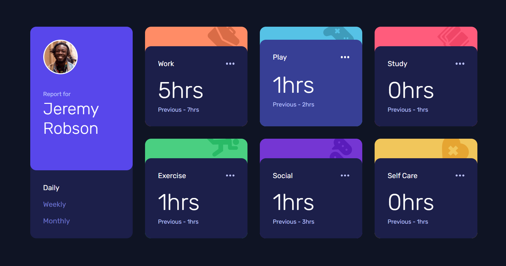

# Frontend Mentor - Time tracking dashboard solution

This is a solution to the [Time tracking dashboard challenge on Frontend Mentor](https://www.frontendmentor.io/challenges/time-tracking-dashboard-UIQ7167Jw). Frontend Mentor challenges help you improve your coding skills by building realistic projects. 

### About

Fourteenth exercice from Frontend Mentor website. The purpose is to train to fondamentals web languages.

**HTML, CSS, JS**

[Preview-site](https://florianjourde.github.io/Frontend-Mentor-14-Time-tracking-dashboard)
